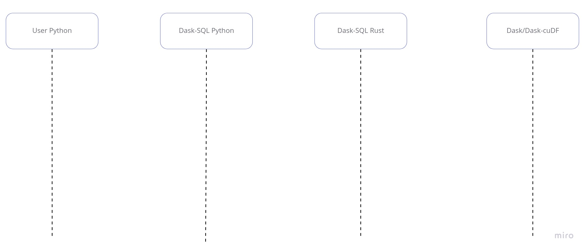

# Contributing to Dask-SQL

## SQL Parsing Overview



## Environment Setup

### Conda
Conda is used both by CI and the development team. Therefore Conda is the fully supported and preferred method for using and developing Dask-SQL.

Installing Conda is outside the scope of this document. However a nice guide for installing on Linux can be found [here](https://docs.conda.io/projects/conda/en/latest/user-guide/install/linux.html)

Setting up your Conda environment for development is straightforward. To setup a new Conda environment you run
```
conda env create -f {DASK_SQL_HOME}/continuous_integration/environment-3.10-dev.yaml
```

The Conda process will take awhile to complete, once finished you will have a resulting environment named `dask-sql` which can be activated and used by running `conda activate dask-sql`

## Python Developers Guide
TODO

## Rust Developers Guide

Dask-SQL utilizes [Apache Arrow Datafusion](https://github.com/apache/arrow-datafusion) for parsing, planning, and optimizing SQL queries. DataFusion is written in Rust and therefore requires some Rust experience to be productive. Luckily, there are tons of great Rust learning resources on the internet. We have listed some of our favorite ones [here](#rust-learning-resources)

### Building
Building the Dask-SQL Rust codebase is a straightforward process. If you create and activate the Dask-SQL Conda environment the Rust compiler and all necessary components will be installed for you during that process and therefore requires no further manual setup.

`setuptools-rust` is used by Dask-SQL for building and bundling the resulting Rust binaries. This helps make building and installing the Rust binaries feel much more like a native Python workflow.

More details about the building setup can be found at [setup.py](setup.py) and searching for `rust_extensions` which is the hook for the Rust code build and inclusion.

Note that while `setuptools-rust` is used by CI and should be used during your development cycle, if the need arises to do something more specific that is not yet supported by `setuptools-rust` you can opt to use `cargo` directly from the command line.

#### Cleaning
```python setup.py clean```
#### Building
```python setup.py install```

### Apache Arrow DataFusion
The Dask-SQL Rust codebase makes heavy use [Apache Arrow DataFusion](https://github.com/apache/arrow-datafusion). Contributors should familiarize themselves with the [codebase](https://github.com/apache/arrow-datafusion) and [documentation](https://docs.rs/datafusion/latest/datafusion/).

#### Purpose
DataFusion provides Dask-SQL with key functionality.
- Parsing SQL query strings into a `LogicalPlan` datastructure
- Future integration points with [substrait.io](https://substrait.io/)
- An optimization framework used as the baseline for creating custom highly efficient `LogicalPlan`s specific to Dask.

#### DataFusion Modules
DataFusion is broken down into a few modules. We consume those modules in our [Cargo.toml](dask_planner/Cargo.toml). The modules that we use currently are

- `datafusion-common` - Datastructures and core logic
- `datafusion-expr` - Expression based logic and operators
- `datafusion-sql` - SQL components such as parsing and planning
- `datafusion-optimizer` - Optimization logic and datastructures for modifying current plans into more efficient ones.

#### Retrieving Upstream Dependencies
During development you might find yourself needing some upstream DataFusion changes not present in the projects current version. Luckily this can easily be achieved by updating [Cargo.toml](dask_planner/Cargo.toml) and changing the `rev` to the SHA of the version you need. Note that the same SHA should be used for all DataFusion modules.

After updating the `Cargo.toml` file the codebase can be re-built to reflect those changes by running `python setup.py install`

#### Local Documentation
Sometimes when building against the latest Github commits for DataFusion you may find that the features you are consuming do not have their documentation public yet. In this case it can be helpful to build the DataFusion documentation locally so that it can be referenced to assist with development. Here is a rough outline for building that documentation locally.

- clone https://github.com/apache/arrow-datafusion
- change into the `arrow-datafusion` directory
- run `cargo doc`
- navigate to `target/doc/datafusion/all.html` and open in your desired browser

### Datastructures
While working in the Rust codebase there are a few datastructures that you should make yourself familiar with. This section does not aim to verbosely list out all of the datastructure with in the project but rather just the key datastructures that you are likely to encounter while working on almost any feature/issue. The aim is to give you a better overview of the codebase without having to manually dig through the all the source code.

- [`PyLogicalPlan`](dask_planner/src/sql/logical.rs) -> [DataFusion LogicalPlan](https://docs.rs/datafusion/latest/datafusion/logical_plan/enum.LogicalPlan.html)
    - Often encountered in Python code with variable name `rel`
    - Python serializable umbrella representation of the entire LogicalPlan that was generated by DataFusion
    - Provides access to `DaskTable` instances and type information for each table
    - Access to individual nodes in the logical plan tree. Ex: `TableScan`
- [`DaskSQLContext`](dask_planner/src/sql.rs)
    - Analogous to Python `Context`
    - Contains metadata about the tables, schemas, functions, operators, and configurations that are persent within the current execution context
    - When adding custom functions/UDFs this is the location that you would register them
    - Entry point for parsing SQL strings to sql node trees. This is the location Python will begin its interactions with Rust
- [`PyExpr`](dask_planner/src/expression.rs) -> [DataFusion Expr](https://docs.rs/datafusion/latest/datafusion/prelude/enum.Expr.html)
    - Arguably where most of your time will be spent
    - Represents a single node in sql tree. Ex: `avg(age)` from `SELECT avg(age) FROM people`
    - Is associate with a single `RexType`
    - Can contain literal values or represent function calls, `avg()` for example
    - The expressions "index" in the tree can be retrieved by calling `PyExpr.index()` on an instance. This is useful when mapping frontend column names in Dask code to backend Dataframe columns
    - Certain `PyExpr`s contain operands. Ex: `2 + 2` would contain 3 operands. 1) A literal `PyExpr` instance with value 2 2) Another literal `PyExpr` instance with a value of 2. 3) A `+` `PyExpr` representing the addition of the 2 literals.
- [`DaskSqlOptimizer`](dask_planner/src/sql/optimizer.rs)
    - Registering location for all Dask-SQL specific logical plan optimizations
    - Optimizations that are written either custom or use from another source, DataFusion, are registered here in the order they are wished to be executed
    - Represents functions that modify/convert an original `PyLogicalPlan` into another `PyLogicalPlan` that would be more efficient when running in the underlying Dask framework
- [`RelDataType`](dask_planner/src/sql/types/rel_data_type.rs)
    - Not a fan of this name, was chosen to match existing Calcite logic
    - Represents a "row" in a table
    - Contains a list of "columns" that are present in that row
        - [RelDataTypeField](dask_planner/src/sql/types/rel_data_type_field.rs)
- [RelDataTypeField](dask_planner/src/sql/types/rel_data_type_field.rs)
    - Represents an individual column in a table
    - Contains:
        - `qualifier` - schema the field belongs to
        - `name` - name of the column/field
        - `data_type` - `DaskTypeMap` instance containing information about the SQL type and underlying Arrow DataType
        - `index` - location of the field in the LogicalPlan
- [DaskTypeMap](dask_planner/src/sql/types.rs)
    - Maps a conventional SQL type to an underlying Arrow DataType


### Rust Learning Resources
- ["The Book"](https://doc.rust-lang.org/book/)
- [Lets Get Rusty "LGR" YouTube series](https://www.youtube.com/c/LetsGetRusty)

## Documentation TODO
- [ ] Python dev guide
- [ ] SQL Parsing overview diagram
- [ ] Architecture diagram
- [x] Setup dev environment
- [x] Version of Rust and specs
- [ ] Updating version of datafusion
- [x] Building
- [ ] Testing
- [ ] Python & Rust with PyO3
- [x] Rust learning resources
- [ ] Types mapping, Arrow datatypes
- [ ] RexTypes explaination, show simple query and show it broken down into its parts in a diagram
- [x] Rust Datastructures local to Dask-SQL
- [x] Build DataFusion documentation locally
- [ ] Registering tables with DaskSqlContext, also functions
- [ ] Creating your own optimizer
- [ ] Rust & PyO3
- [ ] Simple diagram of PyExpr, showing something like 2+2 but broken down into a tree looking diagram
