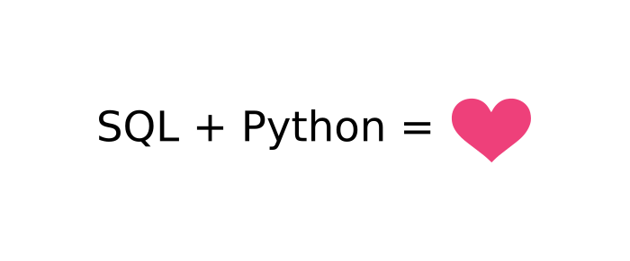
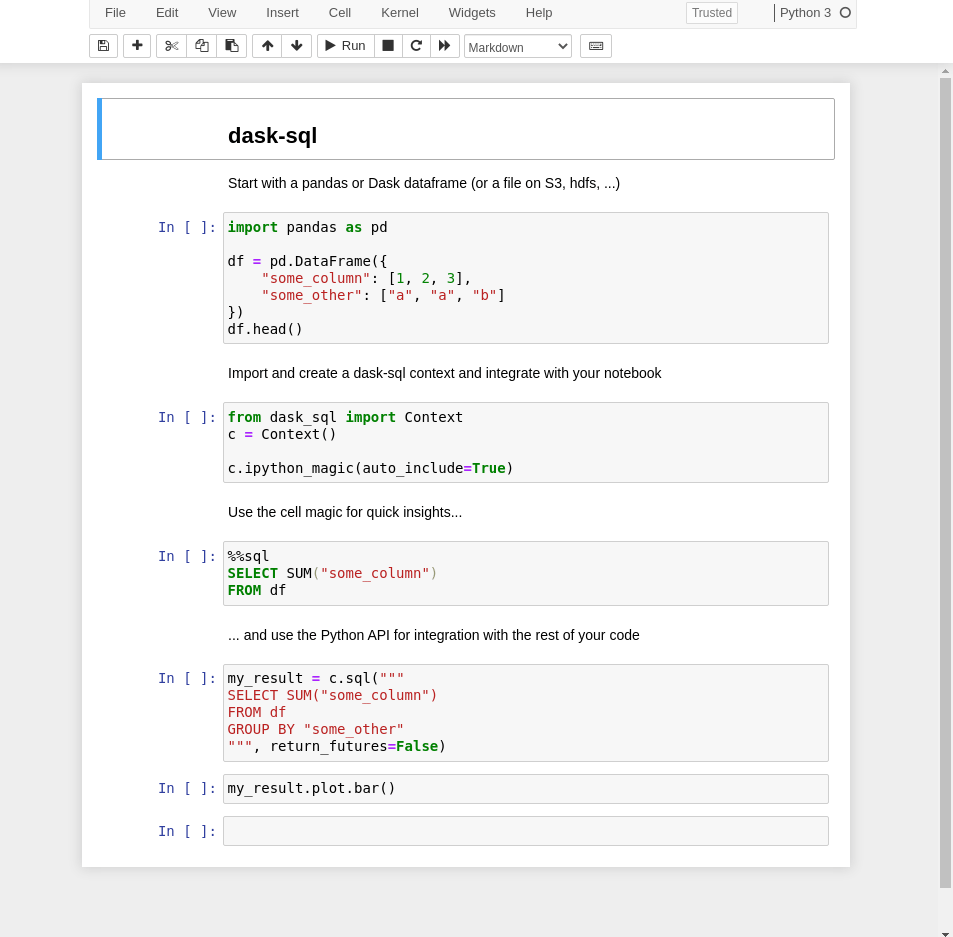

[](https://anaconda.org/conda-forge/dask-sql)
[](https://pypi.python.org/pypi/dask-sql/)
[](https://github.com/dask-contrib/dask-sql/actions/workflows/test.yml?query=branch%3Amain)
[](https://dask-sql.readthedocs.io/en/latest/)
[](https://codecov.io/gh/dask-contrib/dask-sql)
[](https://github.com/dask-contrib/dask-sql/blob/main/LICENSE.txt)
[](https://mybinder.org/v2/gh/dask-contrib/dask-sql-binder/main?urlpath=lab)

<div align="center">
    
</div>

`dask-sql` is a distributed SQL query engine in Python.
It allows you to query and transform your data using a mixture of
common SQL operations and Python code and also scale up the calculation easily
if you need it.

* **Combine the power of Python and SQL**: load your data with Python, transform it with SQL, enhance it with Python and query it with SQL - or the other way round.
  With `dask-sql` you can mix the well known Python dataframe API of `pandas` and `Dask` with common SQL operations, to
  process your data in exactly the way that is easiest for you.
* **Infinite Scaling**: using the power of the great `Dask` ecosystem, your computations can scale as you need it - from your laptop to your super cluster - without changing any line of SQL code. From k8s to cloud deployments, from batch systems to YARN - if `Dask` [supports it](https://docs.dask.org/en/latest/setup.html), so will `dask-sql`.
* **Your data - your queries**: Use Python user-defined functions (UDFs) in SQL without any performance drawback and extend your SQL queries with the large number of Python libraries, e.g. machine learning, different complicated input formats, complex statistics.
* **Easy to install and maintain**: `dask-sql` is just a pip/conda install away (or a docker run if you prefer). No need for complicated cluster setups - `dask-sql` will run out of the box on your machine and can be easily connected to your computing cluster.
* **Use SQL from wherever you like**: `dask-sql` integrates with your jupyter notebook, your normal Python module or can be used as a standalone SQL server from any BI tool. It even integrates natively with [Apache Hue](https://gethue.com/).
* **GPU Support**: `dask-sql` supports running SQL queries on CUDA-enabled GPUs by utilizing [RAPIDS](https://rapids.ai) libraries like [`cuDF`](https://github.com/rapidsai/cudf), enabling accelerated compute for SQL.

Read more in the [documentation](https://dask-sql.readthedocs.io/en/latest/).

<div align="center">
    
</div>

---

## Example

For this example, we use some data loaded from disk and query them with a SQL command from our python code.
Any pandas or dask dataframe can be used as input and ``dask-sql`` understands a large amount of formats (csv, parquet, json,...) and locations (s3, hdfs, gcs,...).

```python
import dask.dataframe as dd
from dask_sql import Context

# Create a context to hold the registered tables
c = Context()

# Load the data and register it in the context
# This will give the table a name, that we can use in queries
df = dd.read_csv("...")
c.create_table("my_data", df)

# Now execute a SQL query. The result is again dask dataframe.
result = c.sql("""
    SELECT
        my_data.name,
        SUM(my_data.x)
    FROM
        my_data
    GROUP BY
        my_data.name
""", return_futures=False)

# Show the result
print(result)
```

## Quickstart

Have a look into the [documentation](https://dask-sql.readthedocs.io/en/latest/) or start the example notebook on [binder](https://mybinder.org/v2/gh/dask-contrib/dask-sql-binder/main?urlpath=lab).


> `dask-sql` is currently under development and does so far not understand all SQL commands (but a large fraction).
We are actively looking for feedback, improvements and contributors!

## Installation

`dask-sql` can be installed via `conda` (preferred) or `pip` - or in a development environment.

### With `conda`

Create a new conda environment or use your already present environment:

    conda create -n dask-sql
    conda activate dask-sql

Install the package from the `conda-forge` channel:

    conda install dask-sql -c conda-forge

### With `pip`

You can install the package with

    pip install dask-sql

### For development

If you want to have the newest (unreleased) `dask-sql` version or if you plan to do development on `dask-sql`, you can also install the package from sources.

    git clone https://github.com/dask-contrib/dask-sql.git

Create a new conda environment and install the development environment:

    conda env create -f continuous_integration/environment-3.9-dev.yaml

It is not recommended to use `pip` instead of `conda` for the environment setup.

After that, you can install the package in development mode

    pip install -e ".[dev]"

The Rust DataFusion bindings are built as part of the `pip install`.
If changes are made to the Rust source in `dask_planner/`, another build/install must be run to recompile the bindings:

    python setup.py build install

This repository uses [pre-commit](https://pre-commit.com/) hooks. To install them, call

    pre-commit install

## Testing

You can run the tests (after installation) with

    pytest tests

GPU-specific tests require additional dependencies specified in `continuous_integration/gpuci/environment.yaml`.
These can be added to the development environment by running

```
conda env update -n dask-sql -f continuous_integration/gpuci/environment.yaml
```

And GPU-specific tests can be run with

```
pytest tests -m gpu --rungpu
```

## SQL Server

`dask-sql` comes with a small test implementation for a SQL server.
Instead of rebuilding a full ODBC driver, we re-use the [presto wire protocol](https://github.com/prestodb/presto/wiki/HTTP-Protocol).
It is - so far - only a start of the development and missing important concepts, such as
authentication.

You can test the sql presto server by running (after installation)

    dask-sql-server

or by using the created docker image

    docker run --rm -it -p 8080:8080 nbraun/dask-sql

in one terminal. This will spin up a server on port 8080 (by default)
that looks similar to a normal presto database to any presto client.

You can test this for example with the default [presto client](https://prestosql.io/docs/current/installation/cli.html):

    presto --server localhost:8080

Now you can fire simple SQL queries (as no data is loaded by default):

    => SELECT 1 + 1;
     EXPR$0
    --------
        2
    (1 row)

You can find more information in the [documentation](https://dask-sql.readthedocs.io/en/latest/pages/server.html).

## CLI

You can also run the CLI `dask-sql` for testing out SQL commands quickly:

    dask-sql --load-test-data --startup

    (dask-sql) > SELECT * FROM timeseries LIMIT 10;

## How does it work?

At the core, `dask-sql` does two things:

- translate the SQL query using [DataFusion](https://arrow.apache.org/datafusion) into a relational algebra, which is represented as a logical query plan - similar to many other SQL engines (Hive, Flink, ...)
- convert this description of the query into dask API calls (and execute them) - returning a dask dataframe.

For the first step, Arrow DataFusion needs to know about the columns and types of the dask dataframes, therefore some Rust code to store this information for dask dataframes are defined in `dask_planner`.
After the translation to a relational algebra is done (using `DaskSQLContext.logical_relational_algebra`), the python methods defined in `dask_sql.physical` turn this into a physical dask execution plan by converting each piece of the relational algebra one-by-one.
